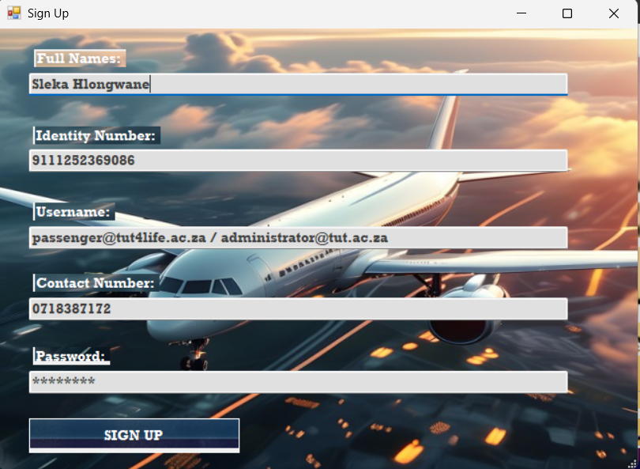
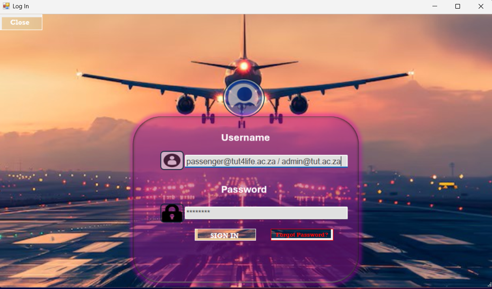
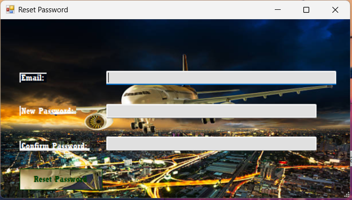
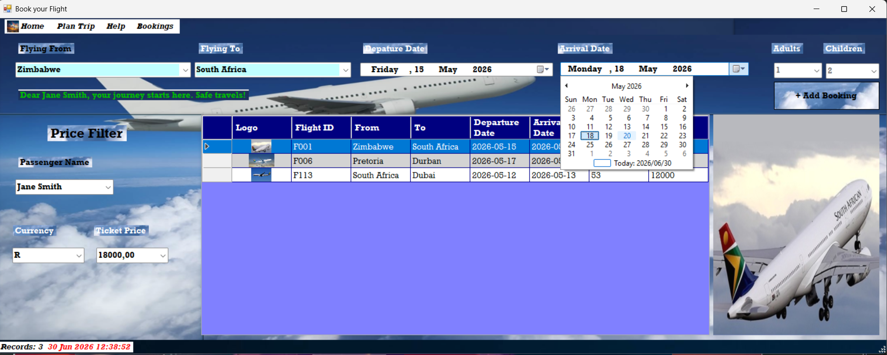
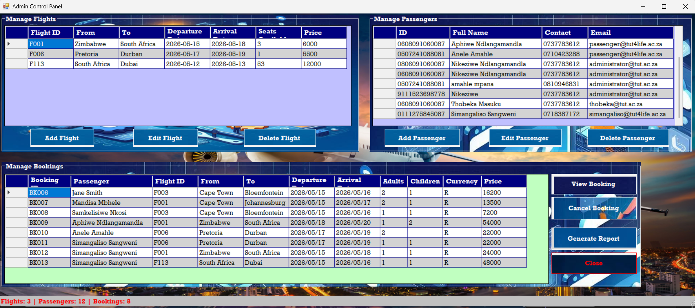
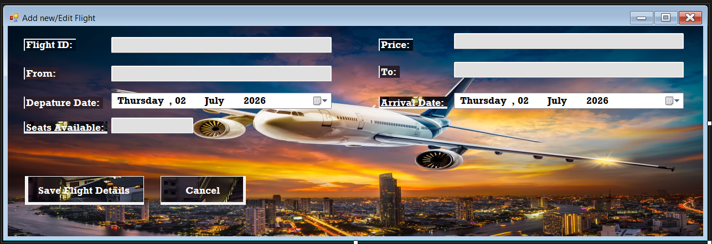
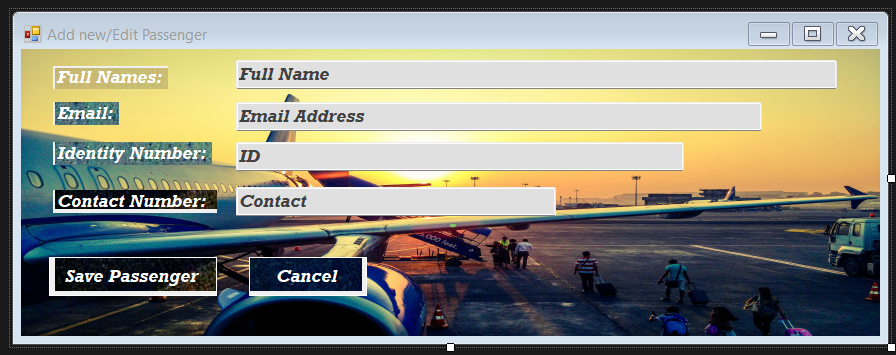

# Flight Reservation System ✈️

A Windows Forms application built in C++/CLI for managing flight reservations.

---

## 🚀 Features
- **Login System**: Admins (`@tut.ac.za`) and Passengers (`@tut4life.ac.za`) with role-based access.
- **Booking Form**: Select flights, passengers, calculate ticket prices, and confirm bookings.
- **Admin Panel**: Manage flights, passengers, and reservations.
- **Passenger Management**: Sign up, edit details, reset passwords.
- **Validation**: Strong input checks for IDs, emails, contact numbers, and dates.
- **UI Polish**: Professional styling with Rockwell fonts, icons, and status strips.

---

## 📸 Screenshots
Screenshots of the forms are available in the `Shoots` folder.

| Home | Signup | Login | Reset Password |
|-------|--------|------------|----------------|
|  |  |  |  |

| Booking | Admin | Add/Edit Flight | Add/Edit Passenger |
|------|---------|-------|------------|
|  |  |  |  |

---

## 🛠️ How to Run
1. Clone the repository:
   ```bash
   git clone https://github.com/Simangaliso24/Flight-Reservation-System.git
